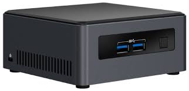
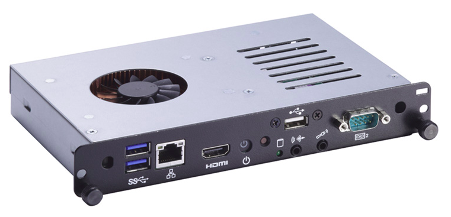

# Intel® Retail Workshop Setup Guide
Welcome to the Intel® Retail Workshop. In this workshop, we will explore  OpenVINO™ through lectures and hands on labs. By the end of the workshop, you should have a solid understanding of  OpenVINO™ toolkit and have some working ideas of how to implement them in your video analytics applications.
## How Do I Use the Lab Material
The links below will guide the workshop attendee through slides and labs in the Visual Retail Workshop using  OpenVINO™ toolkit.
- [Intel® Retail Workshop Linux](https://github.com/SSG-DRD-IOT/intel_retail_workshop/tree/lab-retail-workshop-linux)
-  [Intel® Retail Workshop Windows](https://github.com/SSG-DRD-IOT/intel_retail_workshop/tree/lab-retail-workshop-windows)

## Hardware Used in this Workshop
Intel® offers scalable hardware solutions at different power, performance and price points. During these labs we will be using Dawson Canyon NUC and OPS Device.

**1. Intel® NUC**                     
The Intel® NUC is a powerful 4x4-inch mini PC with entertainment, gaming, and productivity features, including a customizable board that is ready to accept the memory, storage, and operating systems that you want.

### Intel® NUC Key Features
- Intel® Iris™ Pro Graphics 580
- 2x M.2 22x42/80 (key M) slots for SATA3 or PCIe* X4 Gen3 NVMe or AHCI SSDs
SDXC slot with UHS-I support
- 19V, 120W  AC-DC power adapter
- Install your own memory, storage, and operating system (not included)
- Full range of Intel® processors
- NUC support Intel® vPro™ technology, and pre-installed Unite HUB-side software. Business members simply just need to install Unite clients on their own devices for easy and fast connections to meetings.

**2. OPS device**                                                 
Intel® launched the Open Pluggable Specification (OPS) to standardize the system architecture between displays and media players. OPS allows for more cost-effective design, deployment, and management of digital signage and other display solutions that support advanced functionality and emerging use cases, including interactivity and anonymous audience analytics.

As OPS has quickly become a standard for creating integrated display solutions, Intel® is providing the industry with OPS+, offering future-proofed capabilities targeted at higher resolution content and additional use cases.

### OPS Key Features
- 180 mm x 119 mm x 30 mm, fully enclosed.
- Enhanced thermal design supports broader range of Intel® processors.
- Enables new and customizable functionality through an additional connector interface that can be enhanced further with Intel® FPGAs.
- Optimized for interactive white boards (IWBs), commercial digital signage, kiosks, visual data devices, video walls, and more.
- Ability to customize a protocol and simultaneously support advanced use cases including real-time analytics and video capture performed on the display itself.
- Features a second high-speed connector and is backward compatible with previous OPS specifications.
- OPS support Intel® vPro™ technology, and pre-installed Unite HUB-side software. Business members simply just need to install Unite clients on their own devices for easy and fast connections to meetings.
