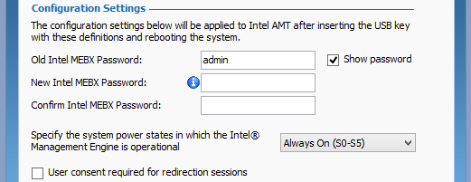
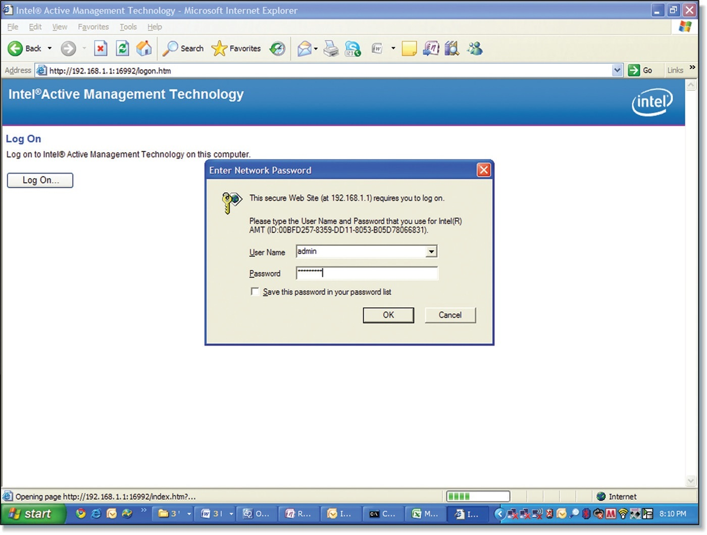
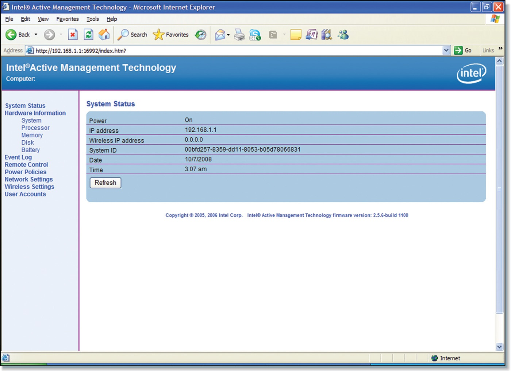

# Intel® AMT

 ## Intel® Active Management Technology

This guide is intended to be a starting point for testing your Intel ® vPro™ technology systems within your environment.

It will guide you through setting up a "Sandbox" test environment using your own network environment so that you can test your specific use cases on Intel® vPro technology that ultimately reduces overall support costs and costly service/truck rolls.

The first step in enabling Intel® AMT is to install the Intel® AMT agent. In this lab, we will manually configure the AMT from BIOS. Then we will verify that the agent is correctly installed by going to a web browser and accessing the Intel® AMT firmware based web configuration console. The Converged Security and Manageability Engine (CSME) powers the Intel AMT system. As a component of the Intel® vPro™ platform, Intel AMT uses a number of elements in the Intel vPro platform architecture.
## Configuring Intel® AMT

Start by performing these actions on your Intel IoT Gateway.

During power up, the Intel AMT platform displays the BIOS startup screen, then it processes the MEBx. During this process, access to the Intel MEBX can be made; however the method is BIOS vendor-dependent. Some methods are discussed here.

*   Most BIOS vendors add entry into the CSME via the one-time boot menu. Select the appropriate key (**Ctrl+P** is typical) and follow the prompts.
*   Some OEM platforms prompt you to press <Ctrl+P> after POST. When you press <Ctrl+P>, control passes to the Intel MEBx (CSME) main menu.
*   Some OEMs integrate the CSME configuration inside the BIOS (uncommon).
*   Some OEMs have an option in the BIOS to show/hide the <Ctrl+P> prompt, so if the prompt is not available in the one-time boot menu, check the BIOS to activate the CTRL+P.

## Change Password
* Select MEBx Login and Press Enter.
* Enter the default password **admin**.

**Troubleshoot**:- If the NUC7i7DNHE (Dawson Canyon) is already AMT configured, it may have Intel@1234 as the password

*   (For first time login) Enter the new password **Intel@1234**.

*The new value must be a strong password. 
It should contain at least one uppercase letter, one lowercase letter, one digit, and one special character, and be at least eight characters.*
**Note**: A management console application can change the Intel AMT password without modifying the CSME password.

## AMT Configuration
*   Select Intel AMT Configuration and Press Enter.
*   Select/Verify Manageability Feature Selection is Enabled.

## Network Configuration
*   Select Network Setup and Press Enter.
*   Select TCP/IP Settings and Press Enter.
*   Select Wired LAN IPV4 Configuration and Press Enter.
*   Enable DHCP Mode
*   Press the Esc key 3 times to navigate to the Intel AMT Configuration menu
*   Select Activate Network Access and Press Enter.
*   Select/Enter "Y" to confirm Activating the interface

*This enables network access for AMT by enabling it.

## Exit
*   Press the Esc key 2 times to navigate to the Main menu and exit
*   Select/Enter "Y"

## Use a Web Browser to Connect to the Intel® Active Management Technology web interface
**Note**: Access to the Intel® AMT web interface with your machine's IP address is not allowed.<br\>
For this section, you will need to work with the person next to you.
The goal is to connect to your neighbor's machine and vice versa.

*   Launch Command Prompt by entering cmd in the Search box witin the Task bar
*   Enter *ipconfig* in the Command Prompt window to get your IP Address
*   Launch a web browser
*   Type the IP address of your neighbor's machine with the port number 16992. (ex. http://<ip_address>:16992)

*   When prompted for username/password, type **admin** as the username and **Intel@1234** as the password

You are now connected. Please explore different sections.

