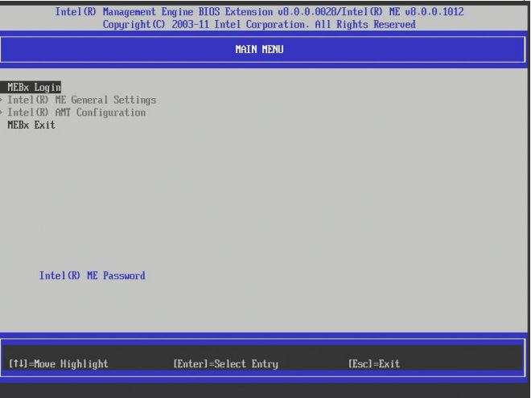
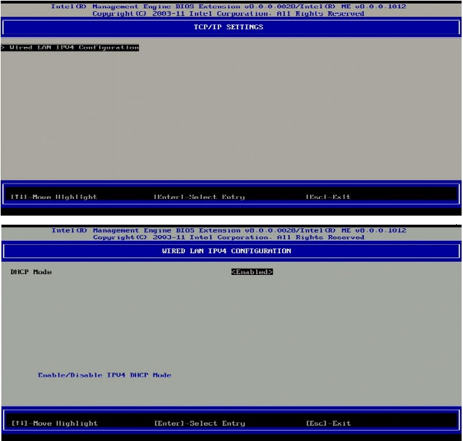

# Intel® AMT

 ## Intel® Active Management Technology

This guide is intended to be a starting point for testing your Intel ® vPro™ technology systems within your environment.

It will guide you through setting up a "Sandbox" test environment using your own network environment so that you can test your specific use cases on Intel® vPro technology that ultimately reduces overall support costs and costly service/truck rolls.

The first step in enabling Intel® AMT is to install the Intel® AMT agent. In this lab, we will manually configure the AMT from BIOS. Then we will verify that the agent is correctly installed by going to a web browser and accessing the Intel® AMT firmware based web configuration console. The Converged Security and Manageability Engine (CSME) powers the Intel AMT system. As a component of the Intel® vPro™ platform, Intel AMT uses a number of elements in the Intel vPro platform architecture.
## Configuring Intel® AMT

Start by performing these actions on your Intel IoT Gateway.

During power up, the Intel AMT platform displays the BIOS startup screen, then it processes the MEBx. During this process, access to the Intel MEBX can be made; however the method is BIOS vendor-dependent. Some methods are discussed here.

*   Most BIOS vendors add entry into the CSME via the one-time boot menu. Select the appropriate key (Ctrl+P is typical) and follow the prompts.
*   Some OEM platforms prompt you to press <Ctrl+P> after POST. When you press <Ctrl+P>, control passes to the Intel MEBx (CSME) main menu.
*   Some OEMs integrate the CSME configuration inside the BIOS (uncommon).
*   Some OEMs have an option in the BIOS to show/hide the <Ctrl+P> prompt, so if the prompt is not available in the one-time boot menu, check the BIOS to activate the CTRL+P.

## Change Password
Enter the CSME default password admin

**Troubleshoot**:- If the NUC is already AMT configured, it may have Intel@1234 as password

*   Change the default password (required to proceed).
*   The new value must be a strong password.
*   It should contain at least one uppercase letter, one lowercase letter, one digit, and one special character, and be at least eight characters.
*   A management console application can change the Intel AMT password without modifying the CSME password.

## AMT Configuration
*   Go back to previous menu using Esc key
*   Select Intel AMT Configuration.
*   Select/Verify Manageability Feature Selection is Enabled.

## Network Configuration
*   Under the Intel® ME Network Setup menu Select 'TCP/IP Settings' and Press Enter.
*   The Intel Network Setup menu changes to the TCP/IP Settings page
*   Goto Wired LAN IPV4 Configuration Under the TCP/IP Settings, Select 'Wired LAN IPV4 Configuration' and press Enter.
*   Enable DHCP
*   Activate Network Access option by enabling it

## Exit
*   Press Esc key to go to exit screen
*   Select "Y" to confirm Activating the interface.
*   Exit CSME.

## Use a Web Browser to Connet to the Intel® Active Management Technology web interface

To use the Intel® Active Management Technology web interface, open a browser and go to the IP address of the Intel® IoT Gateway. The port number is 16992

**For this step, you will need to work with the person next to you.**

You will not be able to access the Intel® AMT web interface, if you are using a web browser on the same machine.

Try to connect to your neighbor's Intel® IoT Gateway and let them connect to yours. http://x.x.x.x:16992

When prompted for username/password, type admin for username and Intel@1234 as the password

You are now connected. Please explore different sections.

