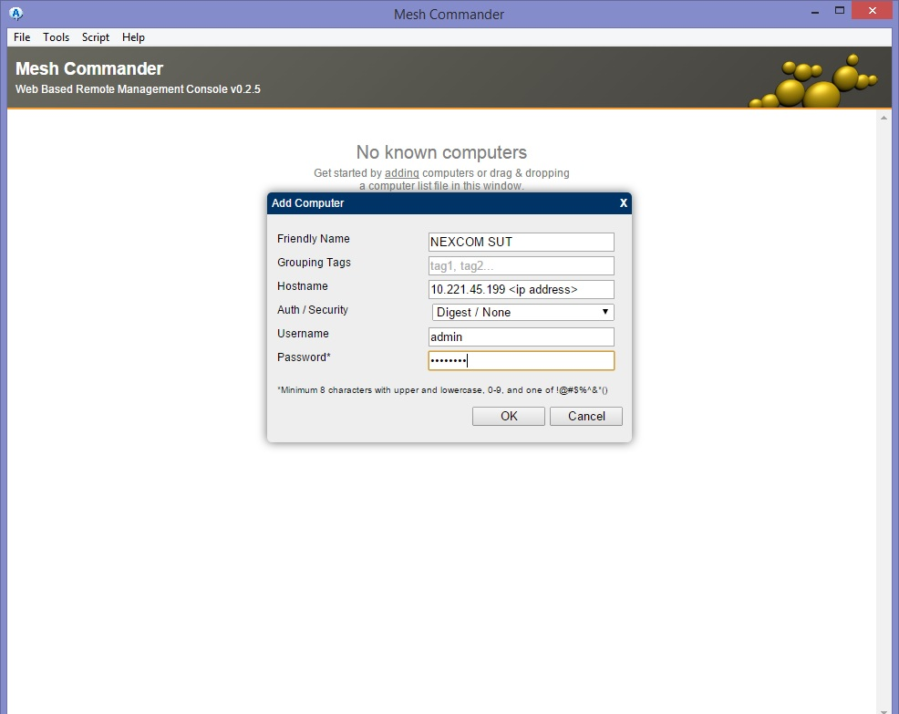
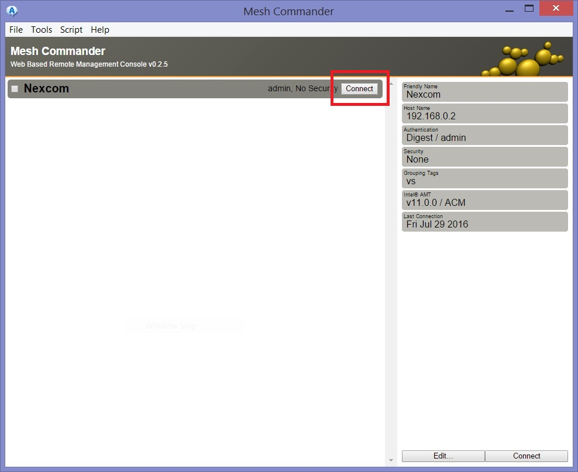
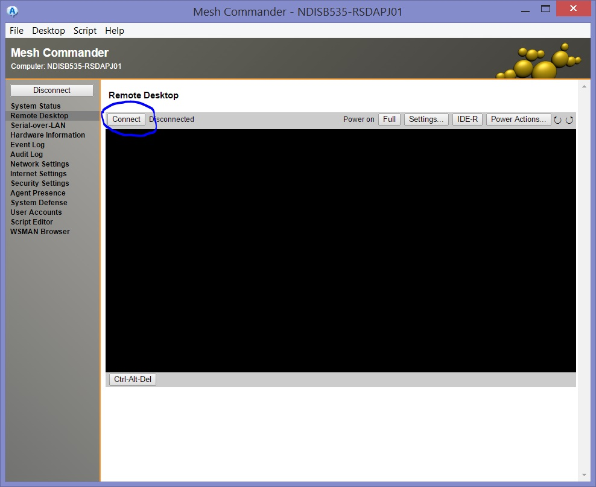
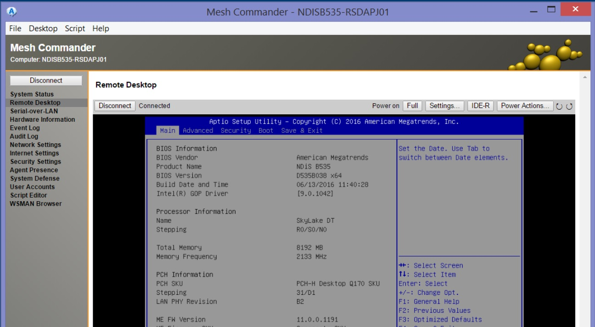
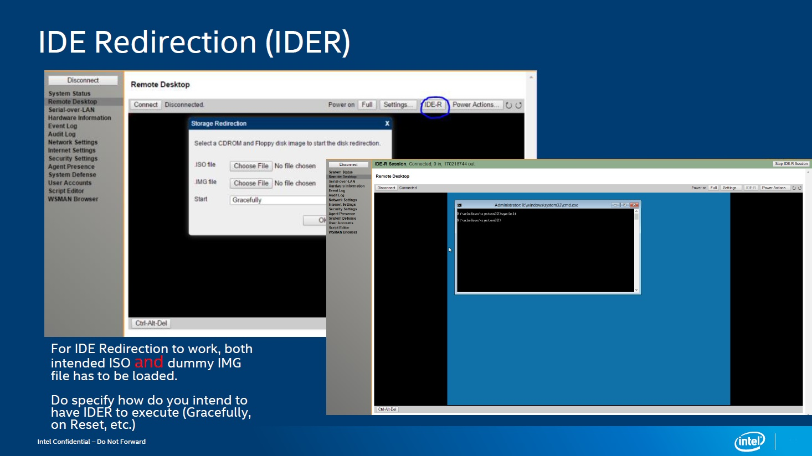

# Remote Configuration with MeshCommander

## Read the Overview

MeshCommander is an application that provides an interface for using Intel® Active Management Technology (Intel® AMT). Its project site states that its purpose is to make hardware configuration easy over Internet.

MeshCommander is primarily used for 1:1 remote management of devices. Current supported features include:

*   Hardware KVM viewer
*   Serial over LAN terminal
*   IDE-R support
*   Power control
*   Event viewer
*   Audit log viewer
*   Hardware asset
*   Account management
*   Network settings
*   WIFI management
*   User consent and control
*   Certificate & TLS management
*   CIRA & Environment Detection
*   WSMAN browser

## Launch the MeshCommander utility
The MeshCommander utility is already installed on your Intel® IoT Gateway

Go to the Windows* launch bar icon in the lower left of your screen and type **Mesh Commander**.

Be sure to right click on the MeshCommander application and select **Run as Administrator**.

## Add An Intel® Active Management Technology enabled Computer to MeshCommander
The first step to add a system to the Intel® AMT mission commander configuration utility is to click on a computer.

After that you can specify a **friendly name** which is simply a string that allows you to easily identify the system.

You can **tags** that allow you to put several systems together into recognizable categories.

You'll need to enter either the **host name** or the **IP address** of the computer.

The **authentication** should remain as digest or none.

Lastly, the **username and password** are the same as username and password that you configured during the USB drive lab.

## Connect to your Intel® IoT Gateway
Next to each computer that has been added to the system there is a button labeled connect.

    Click the Connect button to begin communicating with your gateway.
## Click Remote Desktop
After connecting to a system, you'll see the system information on the screen, such as the power state, the unique identifier and basic settings. Take a moment to browse around and see the different bits of information available to you.

## Click Connect Remote Desktop
To view the screen of the remote computer system, do the following steps:

*   Click on the **Remote Desktop** link in the left sidebar.
*   Then click the **Connect** button as shown in the image

## Out of band Remote Desktop
You will now see the screen of the remote system.

You will be able to see the screen of the remote system even if the remote computer is rebooting, in the BIOS or in a crashed state.

## Power Actions Reset To BIOS
Notice the button labelled **Power Actions**. This button will display a dialog box that allows you to change the state of the system's power. You can start, stop, reboot or choose from other supported power states.

## BIOS Setup Page
Intel® AMT works at at a firmware level, that is at a level lower than the operating system. So it is possible to remote view the display even if when viewing the BIOS.

## IDE-Redirection
*   Navigate to Remote Desktop
*   Click IDE-R, which opens up Storage Redirection
*   Choose any .iso file and .img file
*   "IDE-R Session, Connected, 0 in, 0 out" message will be displayed at top
*   Click Power Actions and select "Reset to IDE-R CDROM"
*   Now observe the top row showing variation in the message "IDE-R Session, Connected, 0 in, ###### out" showing number of packets going out

## IDE-R completed
*   CDROM Image content will be displayed
*   A samle DOS image is loaded here
*   Click the Disconnect button inside the Remote Desktop
*   Click Stop IDE-R Session
*   Goto Power Actions > Reset to complete the session

## MeshCommander's System Defense panel

Within MeshCommander's System Defense panel, you can add to Intel® AMT network filters and policies that can be used to match certain type of network traffic. You can use Intel® AMT system defense to count, drop or rate limit network traffic that matches certain rules. In this page, we look at how to create advanced filters that use the "Matching Rules" box in the "Add System Defense Filter" dialog box.

The "Matching Rules" field is a comma separated list of name and values. The names must have exact capitalization and no extra spaces must be added.

The first matching rule is the **ProtocolID**, usually TCP (6) or UDP (17). For example, if you want to match on TCP traffic, you put "ProtocolID=6" in the matching rules. You must specify a protocol id of TCP or UDP before you can use any of the other filters below.

**DestAddress** and **DestMask** to filter the destination of the packet. Both of these must be used at the same time. For example, you can set the matching rules to "ProtocolID=6,DestAddress=192.168.1.0,DestMask=255.255.255.0". This will filter all packets that go to 192.168.1.\*.

In addition, you can filter based on source address with **SrcAddress** and **SrcMask**. Both must be used at the same time. For example, you can have "ProtocolID=6,SrcAddress=192.168.1.0,SrcMask=255.255.0.0" to match all packets with a source address of 192.168.\*.
