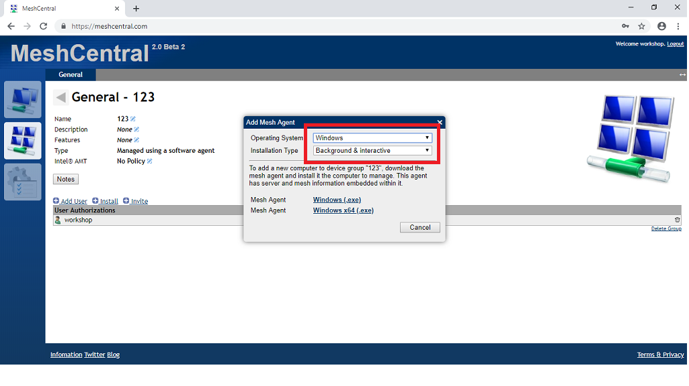
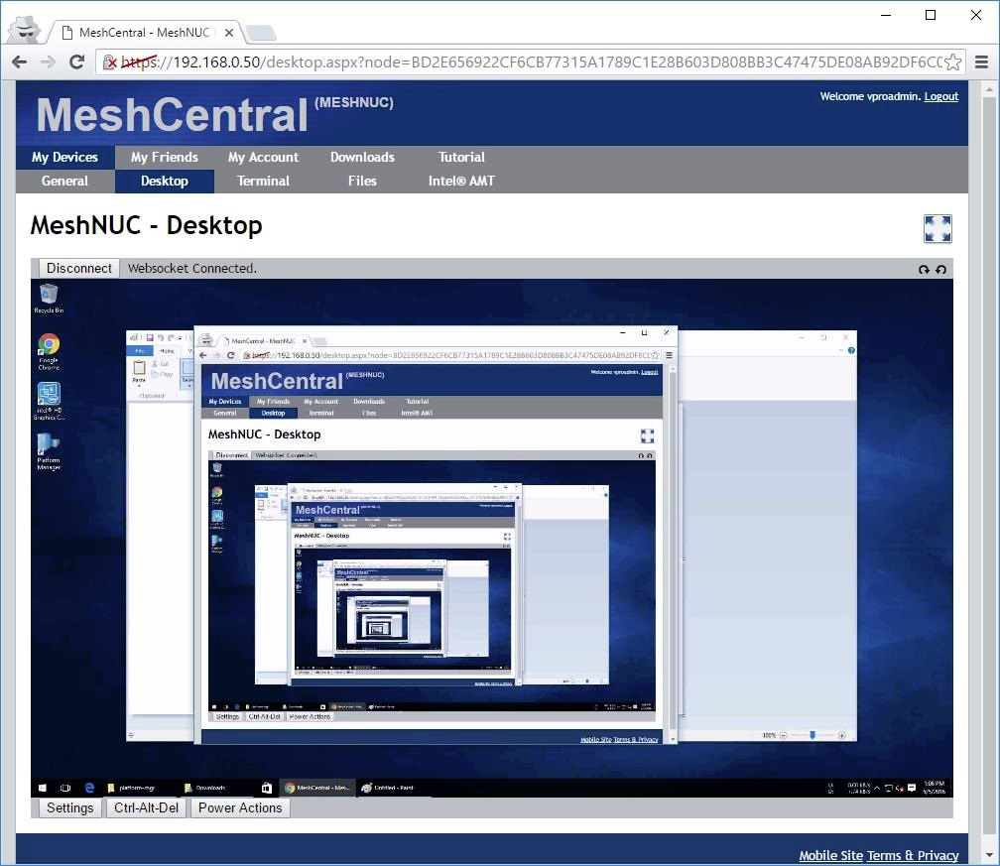

#  Remote System Management with MeshCentral
## Objective
Meshcentral is open source and peer-to-peer technology with a wide range of use cases, including web services that enable remote monitoring and management of computers and devices. Users can manage all their devices from a single web site, no matter the location of the computers or if they are behind routers or proxies.

In this module we will explore following

-   How to create device mesh?
-   How to remotely share desktop of remote machine?
-  How to explore file system on remote machine?
-  How to login to command line?

## Step1: Login to local mesh central server

Url: **Will be given at start of Workshop**

Username: workshop

Password: Intel@123

## Step 2: Create Mesh Agent

*   Click the My Devices icon
*   Click the Add Devices Group button
*   Enter a name for your group

## Step 3: Test & install the created Mesh

*   Click the Add Agent button
*   Click Windows x64 (.exe)
*   Click the Ok button

*   Navigate to the file location of the downloaded Mesh Agent file
*   Right Click the file > Run as administrator
*   Click the Install/Update button

## Step 4: Web device refresh

*   Navigate to the My Devices page
	
**Note**: The newly added device will be shown here within the test Device Group

## Step 5: Explore file system

*   Click the desired device
*   Click the Files Tab
*   Click the Connect button

*   Explore the available file system

## Step 6: Explore Terminal

Supported commands can be ran within a terminal session on the remote device.

*   Click the Terminal Tab
*   Click the Connect button

**Note**: The terminal does not display the user's inputted text as they type.
You will initially be in the C:\Programs Files\Mesh Agent directory.

*   Type **dir**
*   Press Enter to see the inputted command and its corresponding output

## Step 7: Web Socket Desktop Loop

This method accessess the client desktop by web sockets.

It opens another web instance from desktop. This is repeated infinitely

*   Click the Desktop Tab
*   Click the Connect button

## Other Actions
*For this part, select another device other than your own.*

### Send a message to the device
*   Click the Toast button
*   Enter text in the text box
*   Click the Ok button

### View the current processes
*   Click the Tools button

**Notes**: You can stop a process by clicking the trash can.

### Send commands to the device
*   Select an option in the drop down to left of the Send button
*   Click the Send button

You can also save a screenshot of the remote desktop and perform power cycle actions

**Note**: This session allow you to interact with a remote device using your mouse or keyboard. 
If you connect to your own machine, you will not be able to be able to interact with it via the Desktop window.

