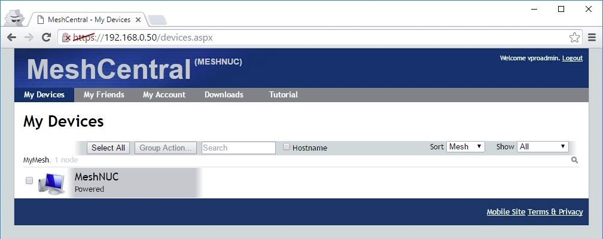
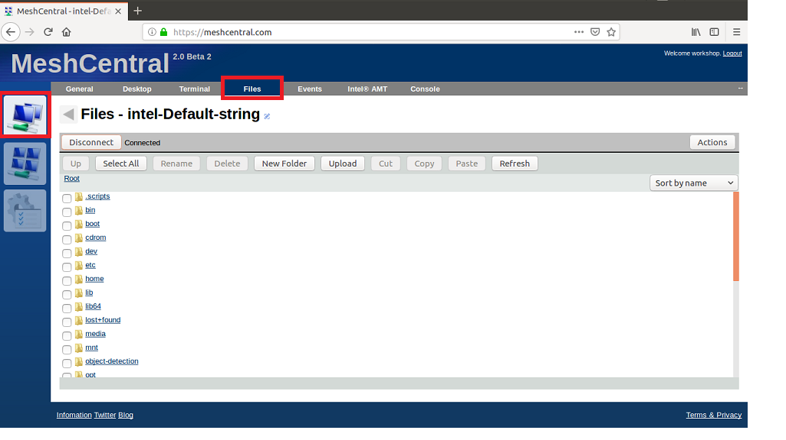

#  Remote System Management with MeshCentral
## Objective
Meshcentral is open source and peer-to-peer technology with a wide range of use cases, including web services that enable remote monitoring and management of computers and devices. Users can manage all their devices from a single web site, no matter the location of the computers or if they are behind routers or proxies.

In this module we will explore following

-   How to create device mesh?
-   How to remotely share desktop of remote machine?
-  How to explore file system on remote machine?
-  How to login to command line?

## Step1: Login to local mesh central server

Url: [https://meshcentral.com](https://meshcentral.com)

Username: workshop

Password: intel@123

## Step 2: Create Mesh Agent

Goto MyAccount tab > Administrative Meshes > New

In the Create new mesh popup, provide mesh name and password

Check mark all the options and click create mesh

## Step 3: Test & install the created Mesh
Goto MyAccount tab and click the newly created mesh.

Have a look on Web Authorizations.

Click on Install

Download **Window Mesh Agent** and **Mesh Policy File**

Run the downloaded Mesh Agent as Administrator to install it.

## Step 4: Web device refresh

Goto MyAccount tab and click the newly created mesh.

This is the method to see the connected devices through web interface.

## Step 5: Explore file system

This method gives access to the client file system.

File operations can be performed to check the level of control

## Step 6: Explore Terminal

This method gives access to terminal through which system supported commands can be run.

## Step 7: Web Socket Desktop Loop

This method accessess the client desktop by web sockets.

It opens another web instance from desktop. This is repeated infinitely

.
