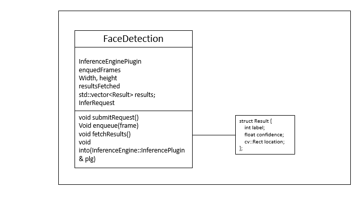
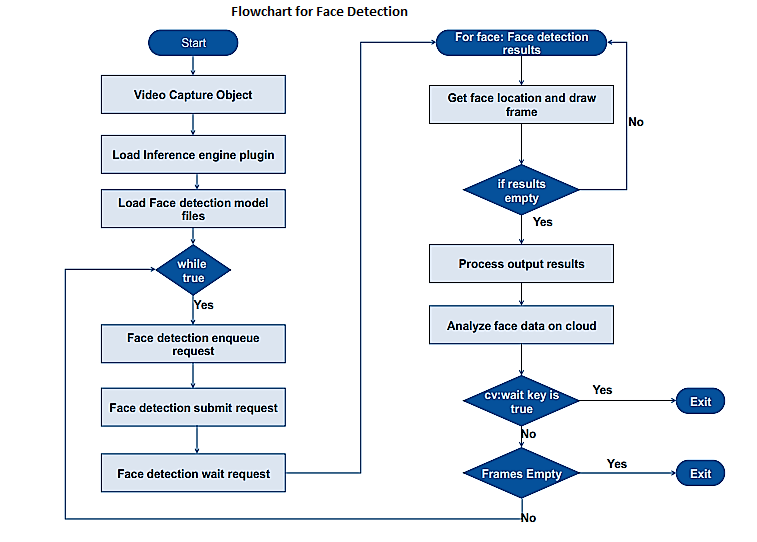

# Face Detection using the Intel® Distribution of OpenVINO™ toolkit
### Lab Overview
In our previous Lab, we have successfully run the prebuilt application using the Intel® Distribution of OpenVINO™ toolkit.

In our next three Labs, we will develop a complete interactive face detection application in three phase.
- Face detection
- Age and Gender detection
- Analyze Face, Gender and Age detection data on cloud

For simplicity, we have created a main.cpp template [here](./solutions/main.cpp.md), which includes required header files and TODOs that to be replaced.
- TODO is small unit of module for code simplification.
- Replace all TODOs with corresponding code snippets provide.
- keep all other TODOs as it is. We will  use these in our next labs

The main.cpp file is available in below path of your device:
***~/Desktop/Retail/OpenVINO/samples/interactive_face_detection_demo/main.cpp***

In this Lab, we will build a Face Detection application which will detect a face from live camera feed. Here, we will be working with TODOs for Face Detection only, keep all other TODOs as it is. We will  use these in our next labs.

**Class diagram for face detection**



### This lab will be laid out as follows:
-	Include the required header files.
-	Capture video frames using OpenCV API.
-	Load in inference engine plugins.
-	Load in pre-trained optimized Face Detection model.
-	Request for inference on GPU.
-	With the inference result, draw a rectangle marking the face.



### 1)Import Required Packages
First, we will include required header files for inferencing with the Intel® Distribution of OpenVINO™ toolkit.
- Replace **#TODO: Face Detection 1** with the following lines of code

```cpp
#include "interactive_face_detection.hpp"
#include "detectors.hpp"
#include <ie_iextension.h>
#include <ext_list.hpp>

```


### 2)Capture Video Frames
we have defined all the required methods for our application development in detector.hpp and detector.cpp. Now we will start developing our face detection application. First step is to capture video frames using OpenCV APIs

- Replace **#TODO: Face Detection 2** with the following lines of code

```cpp
     //TODO: Age and Gender Detection 1
    //If there is a single camera connected, just pass 0.
	cv::VideoCapture cap;
	cap.open(0);
	cv::Mat frame;
	cap.read(frame);
     //TODO: Age and Gender Detection 2
```

### 3)Select GPU for Inferencing Face Detection
Select the plugin device for inference engine where we want to run our inferencing

- Replace **#TODO: Face Detection 3** with the following lines of code


```cpp
    //Select plugins for inference engine
	std::map<std::string, InferencePlugin> pluginsForDevices;

	//Select GPU as plugin device to load Face Detection pre trained optimized model
	InferencePlugin plugin = PluginDispatcher({ "../../../lib/intel64", "" }).getPluginByDevice("GPU");
	pluginsForDevices["GPU"] = plugin;
	//TODO: Age and Gender Detection 3
```

### 4)Load Pre-trained Optimized Data Model on GPU
The pre-trained model XML files have been optimized and generated by the Intel® Distribution of OpenVINO™ toolkit model optimizer from the pre-trained models folder. However, participants are expected to experiment with different pre-trained models available.
- Replace **#TODO: Face Detection 4** with the following lines of code

```cpp
//Load pre trained optimized data model for face detection
FLAGS_Face_Model = "/opt/intel/computer_vision_sdk/deployment_tools/intel_models/face-detection-adas-0001/FP32/face-detection-adas-0001.xml";
FaceDetection faceDetector(FLAGS_Face_Model, FLAGS_d, 1, false, FLAGS_async, FLAGS_t, FLAGS_r);
//Load Face Detection model to target device

faceDetector.load(pluginsForDevices["GPU"]);
//TODO: Age and Gender Detection 4

```

### 5)Main Loop for Inferencing
Here we are populating the face detection object for Inference request, and after getting result we draw rectangular box around the face. Also, we use OpenCV APIs for a display window and exit the window.
- Replace **#TODO: Face Detection 5** with the following lines of code

```cpp
// Main inference loop
while (true) {
//TODO: Cloud Integration 2
//Grab the next frame from camera and populate Inference Request
cap.grab();
faceDetector.enqueue(frame);

//Submit Inference Request for face detection and wait for result
faceDetector.submitRequest();
faceDetector.wait();

//TODO: Age and Gender Detection 5
faceDetector.fetchResults();

//TODO: Age and Gender Detection 6

for (auto & result : faceDetector.results) {
cv::Rect rect = result.location;

//TODO: Age and Gender Detection 7

// Giving same colour to male and female
auto rectColor = cv::Scalar(0, 255, 0);

cv::rectangle(frame, result.location, rectColor, 1);
}
if (-1 != cv::waitKey(1))
break;

cv::imshow("Detection results", frame);

if (!cap.retrieve(frame)) {
break;
}
//TODO: Cloud integration 3
}

  ```

### The Final Solution
Keep the TODO as it is. We will re-use this program during Age and Gender detection.                 
For complete solution, see [face_detection](./solutions/facedetection.md)


### Build the Solution and Observe the Output
- Go to ***~/Desktop/Retail/OpenVINO/samples***  directory
- Create a build directory using below command

```bash
$ cd ~/Desktop/Retail/OpenVINO/samples
$ sudo mkdir build
 ```
 - Set the environment variables by using below commands

```bash
$ cd build
$ sudo -s
# source /opt/intel/computer_vision_sdk/bin/setupvars.sh
  ```

- Build the application using cmake and make commands as below         

```bash
# cmake ..
# make
 ```
- Executable will be generated at ***~/Desktop/Retail/OpenVINO/samples/build/intel64/Release*** directory.
- Run the application by using below command. Make sure camera is connected to the device.

```bash
# cd ~/Desktop/Retail/OpenVINO/samples/build/intel64/Release
# ./interactive_face_detection_demo
 ```
 - On successful execution, face will get detected from a live camera feed window.
### Lesson Learnt
Face Detection using the Intel® Distribution of OpenVINO™ toolkit.


## Next Lab
[Age and Gender Detection using Intel® Distribution of OpenVINO™ toolkit](./Age_Gender_Detection.md)
