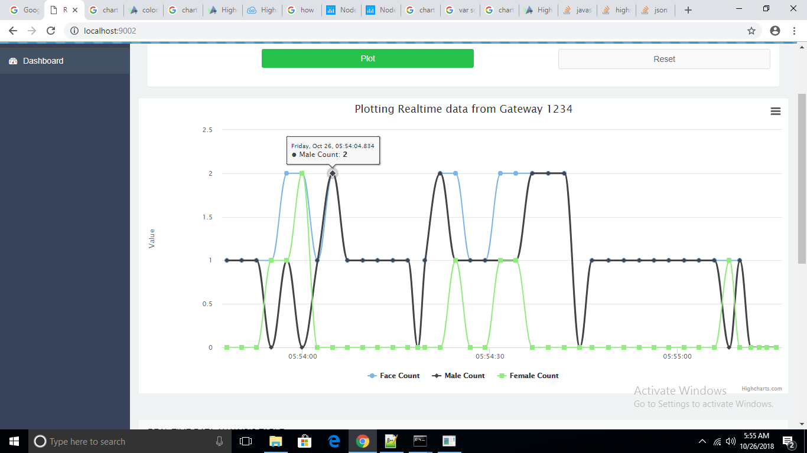

# Analyze Face and Gender Data on Cloud
### Lab Overview
We have done Face, Age and Gender Detection in our previous modules. Also, we have successfully counted number of faces so far.

In this Lab, we will publish this data to local cloud for analysis.

### Tasks to do in this lab

- Declare a device id that will be used for publishing the data to cloud
- Integrate a Python script for publishing the data to cloud
- Publish the number of faces after showing the face count
- Login to cloud and view charts showing the number of faces

### Importing Libraries for Cloud Analysis

- Replace #TODO Import Cloud_Integration packages

```python
import requests
import json
```

### Declare the Device Id

- Replace #TODO Cloud_Integration 2
- Paste the following line and replace the device id “1234” with your device id written on your computer.

```python
deviceid="1234"
```

### Publish Number of Faces to Cloud and Integrate Cloud module

We counted the number of faces successfully. Now, we will publish it to cloud for analysis.       

**Note:** We are not publishing video stream or pictures of the screen. We are only publishing the number of faces. For publishing the data to cloud we will be integrating the following code snippet.

**NOTE** : IP address to be updated with your NUC IP Address
- Replace #TODO Cloud_Integration 3 with below code snippet

```python
#Cloud Analysis
if(framesCounter==10):
    prevFaceCount=curFaceCount
    id = 1234
    count = {"facecount":prevFaceCount, "malecount":malecount, "femalecount":femalecount, "attentivityindex":attentivityindex, "timestamp":time.strftime('%H:%M:%S')}
    query = 'id=' + str(id) + '&value=' + str(prevFaceCount) +'&malecount=' + str(malecount) +'&femalecount=' + str(femalecount);
    with open('C:\\Users\\Intel\\Desktop\\Retail\\OpenVINO\\sAttentivityData.json', 'w') as file:
        file.write(json.dumps(count))
    resp = requests.get('http://192.168.1.100:9002/analytics/face?'+ query);
    if resp.status_code != 201:
        print("Unable to submit the data")
    else:
        print("Data Submitted for analysis")
    print("No. of faces in the frame are {}".format(curFaceCount))
    print("male count is {}".format(malecount))
    print("female count is {}".format(femalecount))
    print("attentivity index is {}".format(attentivityindex))
    print("---------------------------------------------")
    framesCounter=0
```
### Visualizing your Data on the Cloud
Real time visualization of number of people, age and gender on local cloud
- Run local server by using below command
- Go to C:\users\intel\Desktop\Retail\OpenVINO\CloudAnalyticsServer

```
node server.js
 ```
- Go to http://localhost:9002
- Example : 127.0.0.1:9002
- Enter your device id
- Click the plot
- See the real time face count on cloud



###  Final Solution

For complete solution click on following link [analyse_data_on_cloud](./solutions/cloud_analysis.md) which includes Face, Age and Gender detection using the Intel® Distribution of OpenVINO™ toolkit.


- Open command prompt and type this command

```
cd C:\Users\Intel\Desktop\Retail\OpenVINO

python main.py -i cam -m C:\Intel\computer_vision_sdk\deployment_tools\intel_models\face-detection-adas-0001\FP32\face-detection-adas-0001.xml -m_ag C:\Intel\computer_vision_sdk\deployment_tools\intel_models\age-gender-recognition-retail-0013\FP32\age-gender-recognition-retail-0013.xml -m_hp C:\Intel\computer_vision_sdk\deployment_tools\intel_models\head-pose-estimation-adas-0001\FP32\head-pose-estimation-adas-0001.xml -l C:\Users\Intel\Documents\Intel\OpenVINO\inference_engine_samples_2017\intel64\Release\cpu_extension.dll
 ```
- On successful execution, face will get detected and file.json will be created at ***C:\Users\Intel\Desktop\Retail\OpenVINO\.***
### Lesson Learnt
Interfacing Intel® Distribution of OpenVINO™ toolkit with cloud and visualizing data on cloud.


##  

[Video Analytics Home](./README.md)
