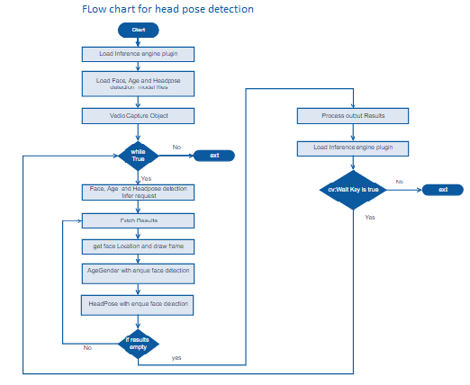

# Head Pose Detection using the Intel® Distribution of OpenVINO™ toolkit
### Lab Overview
We have done Face and Age, Gender Detection in our previous module. Now, we identify Headpose for the identified faces.    
We  build upon our Face Detection code and add Age ,Gender add HeadPose identification code in this module.


### Tasks TODO for HeadPose Detection:
- Define the command line arguments required for head pose detection.
- Defining the function for Headpose axes.
-	Include CPU as plugin device for Headpose detection inference.
-	Load pre-trained data model for Headpose detection.
-	Once Face Detection result is available, submit inference request for Headpose Detection
-	Mark the identified faces inside rectangle and draw Raw, Yaw and Pitch axis.
- Calculate the attentivity index.
-	Observe HeadPose Detection in addition to face.




### Parsing command line arguments

We define the command line arguments.
- Replace #TODO Head_Pose command line arguments
- Paste the following lines


```python
parser.add_argument("-m_hp", "--hp_model", help="Path to an .xml file with a trained model.", default=None, type=str)
parser.add_argument("-d_hp", "--device_hp",
                    help="Target device for Head Pose Estimation network (CPU, GPU, FPGA, or MYRIAD). The demo will look for a suitable plugin for a specified device. (CPU by default)", default="CPU",
                    type=str)
```                    


### Defining function for the Head pose axes
We define the function to calculate and display axis for the face detected.
- Replace #TODO Head_Pose_Detection 1
- Paste the following lines

```python
def drawAxes(pitch,yaw,roll,cpoint,frame):

    pitch *= CV_PI/180.0
    yaw *= CV_PI/180.0
    roll *= CV_PI/180.0

    yawMatrix = np.matrix([[math.cos(yaw), 0, -math.sin(yaw)], [0, 1, 0], [math.sin(yaw), 0, math.cos(yaw)]])                    
    pitchMatrix = np.matrix([[1, 0, 0],[0, math.cos(pitch), -math.sin(pitch)], [0, math.sin(pitch), math.cos(pitch)]])
    rollMatrix = np.matrix([[math.cos(roll), -math.sin(roll), 0],[math.sin(roll), math.cos(roll), 0], [0, 0, 1]])                    

    #Rotational Matrix
    R = yawMatrix * pitchMatrix * rollMatrix
    rows=frame.shape[0]
    cols=frame.shape[1]

    cameraMatrix=np.zeros((3,3), dtype=np.float32)
    cameraMatrix[0][0]= 950.0
    cameraMatrix[0][2]= cols/2
    cameraMatrix[1][0]= 950.0
    cameraMatrix[1][1]= rows/2
    cameraMatrix[2][1]= 1

    xAxis=np.zeros((3,1), dtype=np.float32)
    xAxis[0]=50
    xAxis[1]=0
    xAxis[2]=0

    yAxis=np.zeros((3,1), dtype=np.float32)
    yAxis[0]=0
    yAxis[1]=-50
    yAxis[2]=0

    zAxis=np.zeros((3,1), dtype=np.float32)
    zAxis[0]=0
    zAxis[1]=0
    zAxis[2]=-50

    zAxis1=np.zeros((3,1), dtype=np.float32)
    zAxis1[0]=0
    zAxis1[1]=0
    zAxis1[2]=50

    o=np.zeros((3,1), dtype=np.float32)
    o[2]=cameraMatrix[0][0]

    xAxis=R*xAxis+o
    yAxis=R*yAxis+o
    zAxis=R*zAxis+o
    zAxis1=R*zAxis1+o

    p2x=int((xAxis[0]/xAxis[2]*cameraMatrix[0][0])+cpoint[0])
    p2y=int((xAxis[1]/xAxis[2]*cameraMatrix[1][0])+cpoint[1])
    cv2.line(frame,(cpoint[0],cpoint[1]),(p2x,p2y),(0,0,255),2)

    p2x=int((yAxis[0]/yAxis[2]*cameraMatrix[0][0])+cpoint[0])
    p2y=int((yAxis[1]/yAxis[2]*cameraMatrix[1][0])+cpoint[1])
    cv2.line(frame,(cpoint[0],cpoint[1]),(p2x,p2y),(0,255,0),2)

    p1x=int((zAxis1[0]/zAxis1[2]*cameraMatrix[0][0])+cpoint[0])
    p1y=int((zAxis1[1]/zAxis1[2]*cameraMatrix[1][0])+cpoint[1])

    p2x=int((zAxis[0]/zAxis[2]*cameraMatrix[0][0])+cpoint[0])
    p2y=int((zAxis[1]/zAxis[2]*cameraMatrix[1][0])+cpoint[1])

    cv2.line(frame,(p1x,p1y),(p2x,p2y),(255,0,0),2)
    cv2.circle(frame,(p2x,p2y),3,(255,0,0))


```

### Load Pre-trained Optimized Model for HeadPose Inferencing
We need CPU as plugin device for inferencing HeadPose and load pre-retained model for HeadPose Detection on CPU
- Replace #TODO Head_Pose_Detection 2
- Paste the following lines

```python
# Head Pose  
if args.model and args.hp_model:
    headPose_enabled = True
    #log.info("Loading network files for Head Pose Estimation")
    plugin,hp_net=load_model("Head Pose Estimation",args.hp_model,args.device_hp,args.plugin_dir,1,3,args.cpu_extension)
    hp_input_blob=next(iter(hp_net.inputs))
    hp_out_blob=next(iter(hp_net.outputs))
    hp_exec_net=plugin.load(network=hp_net, num_requests=2)
    hp_n, hp_c, hp_h, hp_w = hp_net.inputs[input_blob].shape
    del hp_net

```

### Use Identified Face for HeadPose Detection
Clip the identified Faces and send inference request for identifying HeadPose
- Replace #TODO Head_Pose_Detection 3
- Paste the following lines

```python
#Heapose
hp_inf_time=0        
if headPose_enabled:
    hp_inf_start = time.time()
    clipped_face_hp = cv2.resize(clippedRect, (hp_w, hp_h))
    clipped_face_hp = clipped_face_hp.transpose((2, 0, 1))  # Change data layout from HWC to CHW
    clipped_face_hp = clipped_face_hp.reshape((hp_n, hp_c, hp_h, hp_w))
    hp_res = hp_exec_net.start_async(request_id=0,inputs={'data': clipped_face_hp})
    if hp_exec_net.requests[cur_request_id].wait(-1) == 0:
        hp_inf_end = time.time()
        hp_inf_time=hp_inf_end - hp_inf_start                       


# analytics_time = age_inf_time + hp_inf_time + em_inf_time + lm_inf_time
analytics_time = age_inf_time + hp_inf_time

```

### Calculate attentivity index
Here attentivityindex will be calculated on the basis of Yaw angle.
- Replace #TODO Head_Pose_Detection 4
- Paste the following lines

```python
if headPose_enabled:
    pitch = ((hp_exec_net.requests[cur_request_id].outputs['angle_p_fc'][0][0]))
    yaw   = ((hp_exec_net.requests[cur_request_id].outputs['angle_y_fc'][0][0]))
    roll  = ((hp_exec_net.requests[cur_request_id].outputs['angle_r_fc'][0][0]))
    cpoint=[int(xmin + (width/2)),int(ymin + (height/2))]
    drawAxes(pitch,yaw,roll,cpoint,frame)
    if (yaw < 5 and yaw > -1.5):
        attentivityindex+=1
    if args.raw:
        print("Head pose results: yaw, pitch, roll = {}, {}, {}".format(yaw, pitch,roll))   
 ```

### The Final Solution
Keep the TODOs as it is. We will re-use this program during Cloud Integration.     
For complete solution click on following link [headpose_detection](./solutions/head_pose_detection.md)


- Open command prompt and type this command

```
python3 main.py -i cam -m /opt/intel/computer_vision_sdk/deployment_tools/intel_models/face-detection-adas-0001/FP32/face-detection-adas-0001.xml -m_ag /opt/intel/computer_vision_sdk/deployment_tools/intel_models/age-gender-recognition-retail-0013/FP32/age-gender-recognition-retail-0013.xml -m_hp /opt/intel/computer_vision_sdk/deployment_tools/intel_models/head-pose-estimation-adas-0001/FP32/head-pose-estimation-adas-0001.xml-l /opt/intel/computer_vision_sdk/inference_engine/samples/build/intel64/Release/lib/libcpu_extension.so
 ```

- On successful execution, Face, Age  Gender and HeadPose will get detected.

### Lesson Learnt
In addition to Face and AgeGender added HeadPose Detection using the Intel® Distribution of OpenVINO™ toolkit.

## Next Lab
[Analyze face data on Cloud](./Analyse_face_data_on_cloud.md)
