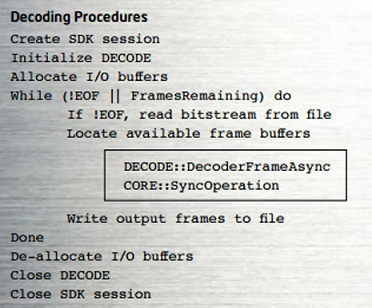

# Build Simple Video Decoder


## Introduction



We will build a custom Console application which performs decoding of elementary compressed video stream and renders them on the screen:

Video Decoding Process

*   Setup parameter to decode pipeline
*   Initialize decoder
*   Decode frame by frame

## Observation

Pass different parameters related to "sInputParams" and observe the difference

## Learning Outcome

By the end of this module, participants would get the basic understanding of building a video decode solution using Intel MSS

## Building new sample

Navigate to workshop/msdk\_samples/samples directory
```
$cd /home/intel\[workshop id\]/Documents/workshop/msdk\_samples/samples
```
Delete the sample\_decode.cpp and CMakeLists.txt files in this custom\_decode project(if exists)
```
$cd custom\_decode

$cd src

$sudo rm -rf sample\_decode.cpp CMakeLists.txt
```
Create new custom\_decode.cpp file to enter your custom decoding program
```
$sudo gedit custom\_decode.cpp
```
Save this custom\_decode.cpp using Ctrl+s

## Inclusions

Open custom\_decode.cpp file to complete the exercise with the code given in the following steps:

Include the pipeline\_decode.h and sstream headers. pipeline\_decode has CDecodingPipeline class which does all the critical tasks associated with decode process.
```
#include "pipeline\_decode.h"
#include <sstream>
```
## Input Processing

Define a method **InputSetup()** that accepts the sInputParams array.

This method first checks the input array for consistency.

Then sets the video type, memory type, hardware acceleration, asynchronous depth factor, mode, etc.,

It also writes the input h264 file path to parameter list
```
mfxStatus InputSetup(sInputParams* pParams)
           {
           //Check the pParams pointer
           MSDK_CHECK_POINTER(pParams, MFX_ERR_NULL_PTR);
           //Set the Video type:
           //MFX_CODEC_AVC for H264 codec
           //MFX_CODEC_JPEG for JPEG codec
           pParams->videoType = MFX_CODEC_AVC;
           msdk_opt_read(MSDK_STRING("/home/intel[workshop id]/Documents/workshop/msdk_samples/samples/input.h264"), pParams->strSrcFile);
           //Set the memory type:
           //D3D11_MEMORY for Directx11
           //D3D9_MEMORY for Directx9
           //SYSTEM_MEMORY for System Memory
           pParams->memType = D3D9_MEMORY;    //For VAAPI
           //set hardware implementation as default
           //Software implementation can be tried by setting this to false.
           pParams->bUseHWLib = true;
           //Depth of asynchronous pipeline, this number can be tuned to achieve better performance.
           pParams->nAsyncDepth = 4;
           //Set the eWorkMode from:
           //MODE_PERFORMANCE,
           //MODE_RENDERING,
           //MODE_FILE_DUMP
           pParams->mode = MODE_RENDERING;
           pParams->libvaBackend = MFX_LIBVA_X11;
           //Some other parameters which can be explored further are:
           /*bool    bIsMVC; // true if Multi-View Codec is in use
           bool    bLowLat; // low latency mode
           bool    bCalLat; // latency calculation
           bool    bUseFullColorRange; //whether to use full color range
           mfxU16  nMaxFPS; //rendering limited by certain fps
           mfxU32  nWallCell;
           mfxU32  nWallW; //number of windows located in each row
           mfxU32  nWallH; //number of windows located in each column
           mfxU32  nWallMonitor; //monitor id, 0,1,.. etc
           bool    bWallNoTitle; //whether to show title for each window with fps value
           mfxU32  numViews; // number of views for Multi-View Codec
           mfxU32  nRotation; // rotation for Motion JPEG Codec
           mfxU16  nAsyncDepth; // asyncronous queue
           mfxU16  nTimeout; // timeout in seconds
           mfxU16  gpuCopy; // GPU Copy mode (three-state option)
           */
           return MFX_ERR_NONE;
           }

```

Declare the pipeline having input file reader, decoder and output file writer.

Then setup the input parameters and perform error checking.

Set the following parameters in the main function
```
int main()
           {
           // input parameters
           sInputParams        Params;
           // pipeline for decoding, includes input file reader, decoder and output file writer
           CDecodingPipeline   Pipeline;
           // return value check
           mfxStatus sts = MFX_ERR_NONE;
           //Setup your input parameters.
           sts = InputSetup(&Params);
           MSDK_CHECK_PARSE_RESULT(sts, MFX_ERR_NONE, 1);


```  
## Decoding Pipeline

Initialise the decoding pipeline and check the error status.

Continue coding in the main function
```
//Initialise the Decode pipeline
            sts = Pipeline.Init(&Params);
            MSDK_CHECK_RESULT(sts, MFX_ERR_NONE, 1);
            //print stream info
            Pipeline.PrintInfo();
            msdk_printf(MSDK_STRING("Decoding started\n"));
```

## Main Decoding Loop


Now let us loop all the frames in the video to decode them using **Pipeline.RunDecoding()**

Every method in MSS returns a status. Based Error handling for incompatible video parameters, lost device, failed device, etc.,

Reset the device using **Pipeline.ResetDevice** in case of hardaware error.

If there are no errors, it will set the flag to **MFX\_ERR\_NONE**

Finally clear all decode buffer and move to the next frame using **Pipeline.ResetDecoder(&Params);**

Continue following coding in the main function
```
for (;;)
            {
            //Decode frame by frame
            sts = Pipeline.RunDecoding();
            if (MFX_ERR_INCOMPATIBLE_VIDEO_PARAM == sts || MFX_ERR_DEVICE_LOST == sts || MFX_ERR_DEVICE_FAILED == sts)
            {
            if (MFX_ERR_INCOMPATIBLE_VIDEO_PARAM == sts)
            {
            msdk_printf(MSDK_STRING("\nERROR: Incompatible video parameters detected. Recovering...\n"));
            }
            else
            {
            msdk_printf(MSDK_STRING("\nERROR: Hardware device was lost or returned unexpected error. Recovering...\n"));
            //Reset device in case of hardware error
            sts = Pipeline.ResetDevice();
            MSDK_CHECK_RESULT(sts, MFX_ERR_NONE, 1);
            }
            //Clear all decode buffer and move to next frame.
            sts = Pipeline.ResetDecoder(&Params);
            MSDK_CHECK_RESULT(sts, MFX_ERR_NONE, 1);
            continue;
            }
            else
            {
            MSDK_CHECK_RESULT(sts, MFX_ERR_NONE, 1);
            break;
            }
            }
            msdk_printf(MSDK_STRING("\nDecoding finished\n"));
            return 0;
            }// End of main
         ```

Save the file by ctrl+s

## Configure and generate solution

Navigate to custom\_decode directory and create CMakeLists file

$cd /home/intel\[workshop id\]/Documents/workshop/msdk\_samples/samples/custom\_decode

$sudo gedit CMakeLists.txt

Make sure your CMakeLists.txt file contents matches the below ones:

include\_directories (

${CMAKE\_CURRENT\_SOURCE\_DIR}/../sample\_common/include

${CMAKE\_CURRENT\_SOURCE\_DIR}/../sample\_misc/wayland/include

${CMAKE\_CURRENT\_SOURCE\_DIR}/include

)

list( APPEND LIBS\_VARIANT sample\_common )

set(DEPENDENCIES libmfx dl pthread)

make\_executable( shortname universal "nosafestring" )

install( TARGETS ${target} RUNTIME DESTINATION ${MFX\_SAMPLES\_INSTALL\_BIN\_DIR} )

Generate, clean and build the project using build.pl script as follows:

cd /home/intel\[workshop id\]/Documents/workshop/msdk\_samples/samples/

$perl build.pl --cmake=intel64.make.debug --build --clean

$make -j4 -C \_\_cmake/intel64.make.debug

End result should say **state: ok**

New folder named \_\_cmake will have executables. Navigate to the same as follows:

$cd \_\_cmake/intel64.make.debug/\_\_bin/debug/

Execute the custom\_decode:

$./custom\_decode

It should show the video rendered on the screen with settings enabled in custom decoding

## Complete Solution

If you have problems in executing your code, you can see the complete custom\_decode source code from below link

[custom\_decode.cpp](views/labs/videoperformance-mediasdksamples/downloads/custom_decode.cpp)

Regenerate, clean and rebuild the code using build.pl script as discussed in previous section

## Execution

./custom\_decode


This example demonstrates hardware based video decoding with output rendered on the screen and details printed in the terminal

## Lesson learnt

Decoding the H.264 stream and exploring supported input parameters from Intel® Media SDK
